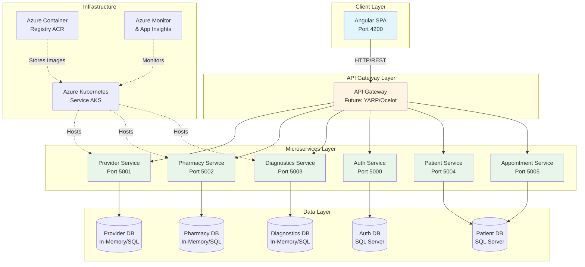
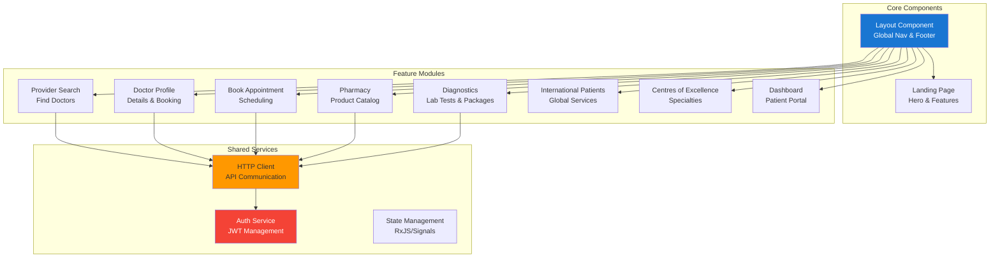
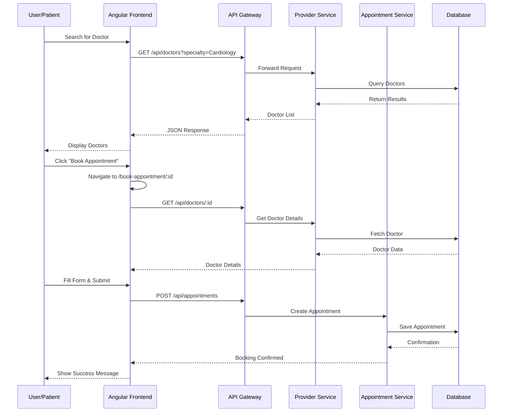
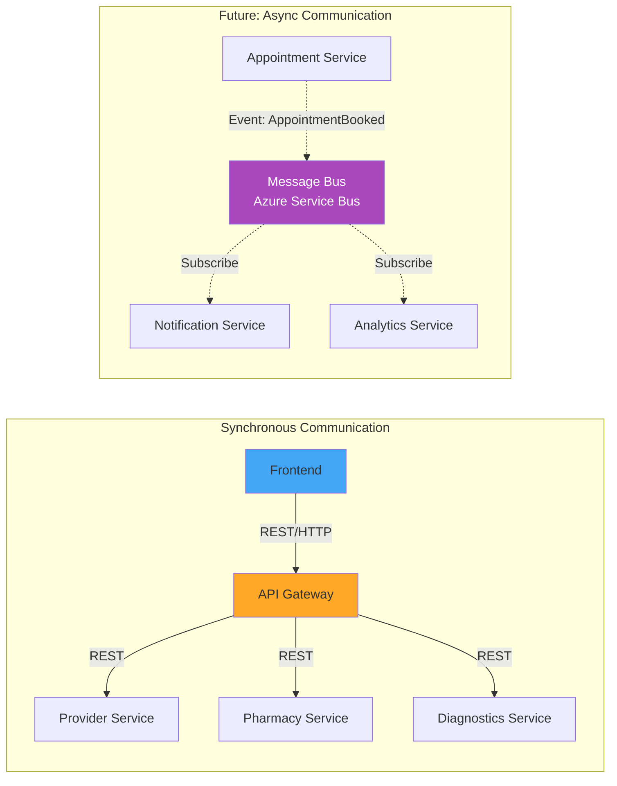
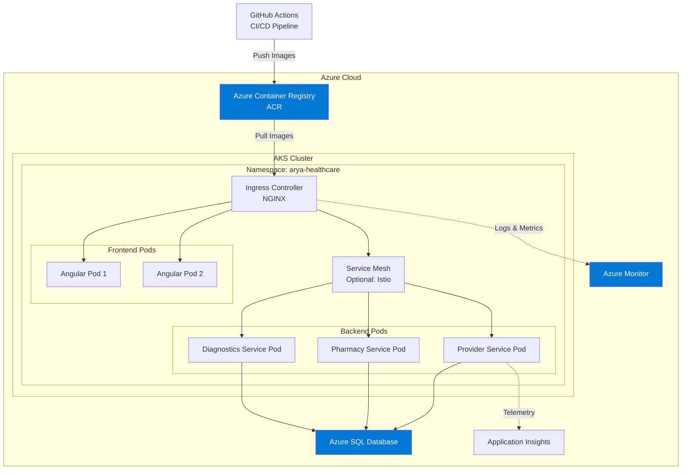

# Arya Healthcare - System Architecture Documentation

## Table of Contents
1. [System Overview](#system-overview)
2. [Architecture Diagrams](#architecture-diagrams)
3. [Technology Stack](#technology-stack)
4. [Frontend-Backend Integration](#frontend-backend-integration)
5. [Database Schema](#database-schema)
6. [Deployment Architecture](#deployment-architecture)
7. [Interview Talking Points](#interview-talking-points)

---

## System Overview

**Arya Healthcare** is a comprehensive digital healthcare platform built using a **microservices architecture** with Angular frontend and .NET backend services. The platform provides end-to-end healthcare services including doctor consultations, pharmacy, diagnostics, and international patient care.

### Key Features
- 🏥 **Provider Search & Booking** - Find and book appointments with specialists
- 💊 **Online Pharmacy** - Order medicines with home delivery
- 🧪 **Diagnostics** - Book lab tests and health packages
- 🌍 **International Patients** - Dedicated services for global patients
- 🏆 **Centres of Excellence** - Specialized care departments
- 📚 **Health Library** - Educational content
- 🤖 **AI Chat Assistant** - 24/7 patient support

---

## Architecture Diagrams

### 1. High-Level System Architecture



### 2. Frontend Component Architecture



### 3. Data Flow Diagram - Appointment Booking



### 4. Microservices Communication Pattern



---

## Technology Stack

### Frontend
| Layer | Technology | Purpose |
|-------|-----------|---------|
| **Framework** | Angular 19 | SPA Framework |
| **Language** | TypeScript | Type-safe development |
| **Styling** | Vanilla CSS | Custom styling |
| **HTTP Client** | Angular HttpClient | API communication |
| **Routing** | Angular Router | Client-side routing |
| **Build Tool** | Angular CLI | Development & Build |

### Backend
| Service | Technology | Database | Port |
|---------|-----------|----------|------|
| **Provider** | .NET 9 Web API | In-Memory/SQL | 5001 |
| **Pharmacy** | .NET 9 Web API | In-Memory/SQL | 5002 |
| **Diagnostics** | .NET 9 Web API | In-Memory/SQL | 5003 |
| **Auth** | .NET 9 Web API | SQL Server | 5000 |
| **Patient** | .NET 9 Web API | SQL Server | 5004 |
| **Appointment** | .NET 9 Web API | SQL Server | 5005 |

### Infrastructure
| Component | Technology | Purpose |
|-----------|-----------|---------|
| **Container Orchestration** | Azure Kubernetes Service (AKS) | Microservices deployment |
| **Container Registry** | Azure Container Registry (ACR) | Docker image storage |
| **Monitoring** | Azure Monitor + App Insights | Observability |
| **CI/CD** | GitHub Actions | Automated deployment |
| **IaC** | Terraform | Infrastructure provisioning |

---

## Frontend-Backend Integration

### API Service Mapping

| Frontend Feature | Backend Service | Endpoints Used |
|-----------------|----------------|----------------|
| **Landing Page - Doctors** | Provider Service | `GET /api/doctors` |
| **Provider Search** | Provider Service | `GET /api/doctors?specialty={name}` |
| **Doctor Profile** | Provider Service | `GET /api/doctors/{id}` |
| **Book Appointment** | Appointment Service | `POST /api/appointments` |
| **Pharmacy Products** | Pharmacy Service | `GET /api/products?category={name}` |
| **Lab Packages** | Diagnostics Service | `GET /api/labpackages?category={name}` |
| **Individual Tests** | Diagnostics Service | `GET /api/labtests` |
| **Centres of Excellence** | Provider Service | `GET /api/doctors?specialty={name}` |
| **International Patients** | Static Content | N/A (Future: Content Service) |

### Sample Integration Code

```typescript
// frontend/src/app/services/provider.service.ts
import { HttpClient } from '@angular/common/http';
import { Injectable } from '@angular/core';
import { Observable } from 'rxjs';

@Injectable({ providedIn: 'root' })
export class ProviderService {
  private apiUrl = 'http://localhost:5001/api/doctors';

  constructor(private http: HttpClient) {}

  getDoctors(specialty?: string): Observable<Doctor[]> {
    const params = specialty ? { specialty } : {};
    return this.http.get<Doctor[]>(this.apiUrl, { params });
  }

  getDoctor(id: number): Observable<Doctor> {
    return this.http.get<Doctor>(`${this.apiUrl}/${id}`);
  }
}
```

---

## Database Schema

### Provider Service Schema

```sql
-- Doctors Table
CREATE TABLE Doctors (
    Id INT PRIMARY KEY IDENTITY(1,1),
    Name NVARCHAR(200) NOT NULL,
    Specialty NVARCHAR(100) NOT NULL,
    Qualification NVARCHAR(200),
    Experience NVARCHAR(50),
    ConsultationFee DECIMAL(10,2),
    ImageUrl NVARCHAR(500),
    Bio NVARCHAR(MAX),
    Languages NVARCHAR(200),
    IsAvailable BIT DEFAULT 1,
    CreatedAt DATETIME2 DEFAULT GETDATE()
);

-- Indexes
CREATE INDEX IX_Doctors_Specialty ON Doctors(Specialty);
CREATE INDEX IX_Doctors_IsAvailable ON Doctors(IsAvailable);
```

### Pharmacy Service Schema

```sql
-- Products Table
CREATE TABLE Products (
    Id INT PRIMARY KEY IDENTITY(1,1),
    Name NVARCHAR(200) NOT NULL,
    Category NVARCHAR(100) NOT NULL,
    Price DECIMAL(10,2) NOT NULL,
    DiscountPrice DECIMAL(10,2),
    ImageUrl NVARCHAR(500),
    PrescriptionRequired BIT DEFAULT 0,
    Description NVARCHAR(MAX),
    CreatedAt DATETIME2 DEFAULT GETDATE()
);

-- Indexes
CREATE INDEX IX_Products_Category ON Products(Category);
```

### Diagnostics Service Schema

```sql
-- Lab Packages Table
CREATE TABLE LabPackages (
    Id INT PRIMARY KEY IDENTITY(1,1),
    Name NVARCHAR(200) NOT NULL,
    Category NVARCHAR(100) NOT NULL,
    Price DECIMAL(10,2) NOT NULL,
    DiscountPrice DECIMAL(10,2),
    Description NVARCHAR(MAX),
    TestsIncluded INT,
    ImageUrl NVARCHAR(500),
    CreatedAt DATETIME2 DEFAULT GETDATE()
);

-- Lab Tests Table
CREATE TABLE LabTests (
    Id INT PRIMARY KEY IDENTITY(1,1),
    Name NVARCHAR(200) NOT NULL,
    Price DECIMAL(10,2) NOT NULL,
    Description NVARCHAR(MAX),
    FastingRequired BIT DEFAULT 0,
    CreatedAt DATETIME2 DEFAULT GETDATE()
);
```

---

## Deployment Architecture

### Azure Kubernetes Service (AKS) Deployment



### Infrastructure as Code (Terraform)

```hcl
# infra/main.tf
resource "azurerm_kubernetes_cluster" "aks" {
  name                = "arya-healthcare-aks"
  location            = var.location
  resource_group_name = azurerm_resource_group.rg.name
  dns_prefix          = "aryahealth"

  default_node_pool {
    name       = "default"
    node_count = 3
    vm_size    = "Standard_D2s_v3"
  }

  identity {
    type = "SystemAssigned"
  }
}

resource "azurerm_container_registry" "acr" {
  name                = "aryahealthacr"
  resource_group_name = azurerm_resource_group.rg.name
  location            = var.location
  sku                 = "Standard"
  admin_enabled       = true
}
```

---

## Interview Talking Points

### 1. **Architecture Decision: Microservices**
> "I chose a microservices architecture to ensure **scalability** and **independent deployment**. Each service (Provider, Pharmacy, Diagnostics) can scale independently based on load. For example, during flu season, the Diagnostics service might need more instances."

### 2. **Technology Choices**
> "I selected **.NET 9** for the backend because of its **high performance**, **cross-platform support**, and **built-in dependency injection**. Angular was chosen for the frontend due to its **enterprise-grade features**, **TypeScript support**, and **strong CLI tooling**."

### 3. **Database Strategy**
> "Currently using **In-Memory databases** for rapid development and demo purposes. The architecture is designed for easy migration to **Azure SQL** or **PostgreSQL** using Entity Framework Core migrations. Each microservice owns its database following the **Database-per-Service** pattern."

### 4. **API Design**
> "All APIs follow **RESTful principles** with proper HTTP verbs (GET, POST, PUT, DELETE). I've implemented **Swagger/OpenAPI** documentation for all services, making it easy for frontend developers to integrate and for testing during development."

### 5. **Frontend Architecture**
> "The Angular frontend uses **standalone components** (Angular 19 feature) for better tree-shaking and lazy loading. I've implemented a **service layer** pattern to abstract API calls, making it easy to switch backends or add caching."

### 6. **Security Considerations**
> "The architecture includes an **Auth Service** for JWT-based authentication. In production, I would implement **OAuth 2.0/OpenID Connect**, **API rate limiting**, and **CORS policies**. All sensitive data would be encrypted at rest and in transit using TLS."

### 7. **Observability**
> "I've planned for **Azure Monitor** and **Application Insights** integration. Each service would emit structured logs, metrics (RED: Rate, Errors, Duration), and distributed traces using **OpenTelemetry**."

### 8. **CI/CD Pipeline**
> "The deployment uses **GitHub Actions** for CI/CD. On every commit, it builds Docker images, runs tests, pushes to ACR, and deploys to AKS using **Helm charts**. This enables **continuous delivery** with automated rollbacks."

### 9. **Scalability**
> "The system can handle increased load through **horizontal pod autoscaling** in Kubernetes. The stateless nature of the services makes scaling straightforward. For the database layer, I would implement **read replicas** for high-traffic queries."

### 10. **Future Enhancements**
> "Planned improvements include:
> - **Event-driven architecture** using Azure Service Bus for async communication
> - **API Gateway** (YARP/Ocelot) for centralized routing and authentication
> - **Redis caching** for frequently accessed data
> - **GraphQL** for flexible frontend queries
> - **Mobile apps** using React Native or Flutter"

---

## Feature Demonstration Flow

### For Interview Demo:

1. **Landing Page** → Show professional design with real doctor images
2. **Provider Search** → Filter by specialty (Cardiology)
3. **Doctor Profile** → View detailed bio, qualifications
4. **Book Appointment** → Fill form, show validation
5. **Pharmacy** → Browse products by category
6. **Diagnostics** → Show health packages with accordion sidebar
7. **Centres of Excellence** → Navigate to specialty detail page
8. **International Patients** → Highlight global services
9. **Backend APIs** → Open Swagger UI, demonstrate live API calls
10. **Architecture Diagram** → Walk through this document

---

## Project Statistics

| Metric | Count |
|--------|-------|
| **Frontend Components** | 15+ |
| **Backend Services** | 6 |
| **API Endpoints** | 20+ |
| **Database Tables** | 8+ |
| **Lines of Code (Frontend)** | ~3,000 |
| **Lines of Code (Backend)** | ~1,500 |
| **Documentation Pages** | 10+ |

---

## Quick Start Commands

```bash
# Frontend
cd frontend
npm install
ng serve --port 4200

# Backend Services
cd backend/src/FullHealth.Provider
dotnet run --urls="http://localhost:5001"

cd backend/src/FullHealth.Pharmacy
dotnet run --urls="http://localhost:5002"

cd backend/src/FullHealth.Diagnostics
dotnet run --urls="http://localhost:5003"

# Access Points
# Frontend: http://localhost:4200
# Provider API: http://localhost:5001/swagger
# Pharmacy API: http://localhost:5002/swagger
# Diagnostics API: http://localhost:5003/swagger
```

---

**Document Version:** 1.0  
**Last Updated:** December 2025  
**Author:** Arya Healthcare Development Team
